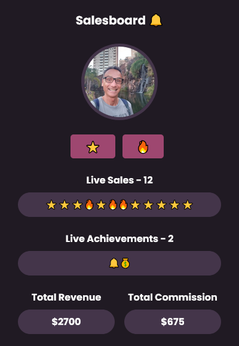

# Scrimba Bootcamp - Solo Projects

This is a solution to the [M3 - Salesboard](https://scrimba.com/scrim/co7fe43cfb10cd6f888c51d06).

## Screenshot

## Links

- Live Site: [Netlify]()
- Codebase: [Github](https://github.com/abilioassis/salesboard)
- Code review: [Scrimba]()

## Built with

- Semantic HTML5 markup.
- Flexbox.
- JavaScript (no frameworks).

## Author

- [Abilio Assis](https://www.linkedin.com/in/abilio-assis/)
